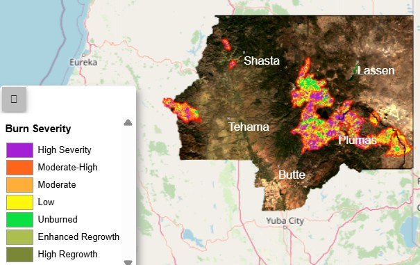
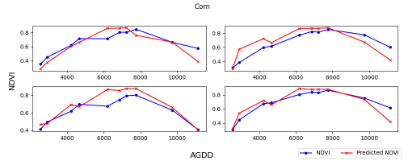

# PORTFOLIO

## [Dixie Fire Burn Severity And Vegetation Recovery Mapping](https://henry-os.github.io/DixieFire_Monitoring/)
In this project, I mapped the burn severity and evaluated vegetation recovery and land cover changes following the 2021 Dixie Fire in Northern California. Data from the Harmonized Landsat Sentinel (HLS) iniative was used to generate indices such as the Normalized Burn Ratio (NBR), Normalized Difference Vegetation Index (NDVI), and Enhanced Vegetation Index (EVI) for burn severity and vegetation recovery analysis. Dynamic World Land Cover data was also to assess land cover transitions from 2020 to 2024. 

**Affiliation:** *Personal Project*

## [NASA DEVELOP Texas & Georgia Agriculture Spring 2025 Project](https://github.com/Henry-Os/Texas-GeorgiaAg-NASA-Develop-.git)
As part of a team of four on the NASA DEVELOP national program, this project sought to investigate environmental drivers of cotton quality and yield across two high production regions (Southern Georgia and Western Texas) with distinct climate zones in the U.S. In addition to cotton quality metrics and production data from the USDA, we used earth observations from the Harmonized Landsat Sentinel,  Global Precipitation Measurement Integrated Multi-satellite Retrievals for GPM (GPM-IMERG), and Soil Moisture Active Passive (SMAP) missions and derived key variables like the Enhanced Vegetation Index (EVI), precipitation, soil moisture, wind speed, and growing degree days over a ten-year period (2015-2024). Using multiple regression models, results indicated that wet autumns correlated with lower cotton brightness, summer EVI affected quality in Georgia, and August soil moisture was a major factor in Texas. Models incorporating Earth observations improved cotton quality assessments compared to those relying solely on field data.  
**NB:** The technical paper and other science communication materials (flyer & poster) are under review and will be added to the GitHub repo once it has been completed.

**Affiliation:** *NASA DEVELOP*  

Image Credit: NASA DEVELOP

## [Estimating Optical Vegetation Indices Using SAR Data for Crop Monitoring](https://github.com/Henry-Os/Thesis_project.git)
For my master’s thesis, I addressed data gaps in optical remote sensing caused by cloud interference by leveraging SAR data to estimate vegetation indices (NDVI and EVI), with a focus on model transferability. To ensure robustness, I utilized a dense time-series of satellite observations spanning four geographically diverse regions and multiple crop seasons (2015–2023), incorporating time/phenology-related metrics such as accumulated growing degree days (AGDD) and days-after-planting (DAP). Using Light Gradient Boosting Machine (LightGBM) as the base algorithm, model configurations that incorporated AGDD in addition to SAR variables consistently achieved the highest accuracy and stability in performance across all test scenarios, especially for NDVI, demonstrating strong generalizability across varying regions and crop conditions.   
**NB:** The technical paper is under preparation for a peer-reviewed publication and will be added to the GitHub repo once it has been completed.

**Affiliation:** *Bowling Green State University*  
 

## [Glaciers at the Glacier National Park](https://github.com/Henry-Os/Maps.git)
For my final project in Advanced Cartography course, I created a map of the Glacier National Park and some of its prominent glaciers. Publicly available geospatial data such as DEM, road, lakes, glaciers, points of interest, etc. were sourced to author 2D and 3D static maps.  
  
**Affiliation:** *Bowling Green State University*  

## Upcoming and Current projects
1. NASA DEVELOP Priest Lake Water Resources Summer 2025
2. Crop Classification Using Optical and SAR Data
